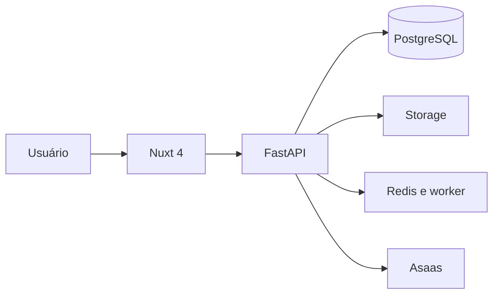

# Manual de evolução técnica do Contaflow

**Versão:** 1.0  
**Data-base:** 23 de agosto de 2026  
**Stack-alvo:** Nuxt 4 + FastAPI + PostgreSQL/Supabase  
**Objetivo:** orientar a modernização do Contaflow sem interromper a operação atual e sem reescrever partes estáveis sem necessidade.

---

## 1. Visão geral

O Contaflow será modernizado gradualmente. A principal mudança será a substituição do frontend atual em Vue 3 + Vite por Nuxt 4. O backend continuará em FastAPI, com melhorias de arquitetura, segurança, confiabilidade, testes e escalabilidade.

A migração não será tratada como uma simples troca visual. Antes de substituir a aplicação em produção, corrigiremos riscos existentes nas regras de negócio, especialmente recorrências, cobrança, migrations, isolamento entre empresas e processamento assíncrono.

### Resultado esperado

Ao final do plano, o Contaflow deverá ter:

- páginas públicas rápidas, indexáveis e preparadas para SEO;
- dashboard moderno e responsivo em Nuxt 4;
- API FastAPI organizada por domínio;
- banco de dados reproduzível exclusivamente por migrations;
- cobrança confiável e auditável;
- recorrências sem duplicações;
- processamento assíncrono de alertas e rotinas;
- testes automatizados dos fluxos críticos;
- monitoramento de erros e indicadores operacionais;
- documentação de arquitetura, API e operação;
- base segura para adicionar novas funcionalidades.

---

## 2. Princípios do projeto

Todas as decisões devem respeitar estes princípios:

1. **Migrar gradualmente:** a aplicação atual continuará funcionando enquanto o novo frontend é construído.
2. **Não reescrever sem benefício claro:** o FastAPI será mantido enquanto atender bem ao produto.
3. **Regra de negócio no backend:** cobranças, permissões, recorrências e limites de plano não ficarão no Nuxt.
4. **Isolamento multiempresa obrigatório:** toda consulta deverá considerar a organização do usuário autenticado.
5. **Automação idempotente:** repetir um webhook ou tarefa agendada não poderá criar cobranças ou obrigações duplicadas.
6. **Migrations como fonte de verdade:** um banco vazio deverá ser criado apenas com Alembic.
7. **Segurança por padrão:** o frontend nunca será considerado uma barreira de autorização.
8. **Observabilidade antes da escala:** erros e rotinas importantes deverão ser monitorados.
9. **Funcionalidade concluída inclui testes:** uma entrega crítica sem verificação automatizada não será considerada finalizada.
10. **Mudanças pequenas e reversíveis:** cada etapa deve poder ser publicada e revertida separadamente.

---

## 3. Arquitetura-alvo

### Frontend — Nuxt 4

Responsável por:

- páginas públicas e institucionais;
- interface do dashboard;
- navegação e experiência do usuário;
- formulários e validações de experiência;
- metadados, SEO e compartilhamento social;
- estado da sessão no navegador;
- consumo tipado da API FastAPI.

O Nuxt poderá usar rotas auxiliares do Nitro quando houver benefício técnico, mas não deverá concentrar regras centrais do produto.

### Backend — FastAPI

Responsável por:

- autenticação e autorização;
- isolamento multi-tenant;
- clientes e responsáveis;
- obrigações, tarefas e recorrências;
- documentos e permissões de acesso;
- planos e limites de uso;
- assinaturas e integração com Asaas;
- notificações;
- relatórios;
- auditoria e regras de negócio.

### Dados e serviços

- **PostgreSQL/Supabase:** banco de dados principal.
- **Supabase Auth:** autenticação, enquanto continuar adequada ao produto.
- **Supabase Storage:** armazenamento de documentos.
- **Redis:** filas, locks, cache pontual e controle de tarefas.
- **Worker:** alertas, recorrências, e-mails e outros processos assíncronos.
- **Asaas:** assinaturas, cobranças e webhooks.
- **Sentry ou equivalente:** rastreamento de erros.
- **GitHub Actions:** lint, testes, build e validação de migrations.

### Fluxo principal



---

## 4. Organização recomendada do projeto

```text
contaflow/
├── frontend/                 # Nuxt 4
│   ├── app/
│   │   ├── components/
│   │   ├── composables/
│   │   ├── layouts/
│   │   ├── middleware/
│   │   ├── pages/
│   │   ├── plugins/
│   │   ├── stores/
│   │   └── utils/
│   ├── shared/
│   │   └── types/
│   ├── tests/
│   └── nuxt.config.ts
├── backend/
│   ├── app/
│   │   ├── api/
│   │   ├── core/
│   │   ├── domains/
│   │   ├── integrations/
│   │   ├── models/
│   │   ├── repositories/
│   │   ├── schemas/
│   │   ├── services/
│   │   └── workers/
│   ├── alembic/
│   └── tests/
├── docs/
├── .github/workflows/
└── README.md
```

Não será necessário reorganizar tudo de uma só vez. Os arquivos serão movidos conforme forem alterados, evitando uma grande mudança estrutural sem ganho funcional.

---

## 5. Fase 0 — estabilização e proteção

**Prioridade:** crítica  
**Objetivo:** criar uma base segura antes da migração.

### 5.1 Criar ambientes separados

- [ ] Definir ambientes de desenvolvimento, homologação e produção.
- [ ] Usar bancos e buckets diferentes para cada ambiente.
- [ ] Revisar variáveis de ambiente e remover segredos do repositório.
- [ ] Criar `.env.example` sem valores confidenciais.
- [ ] Documentar como executar frontend, backend e migrations localmente.
- [ ] Configurar CORS explicitamente por ambiente.

### 5.2 Criar proteção de implantação

- [ ] Exigir build e testes antes de merge na branch principal.
- [ ] Configurar preview do frontend por pull request.
- [ ] Criar homologação da API.
- [ ] Definir processo de rollback.
- [ ] Fazer backup antes de migrations destrutivas.

### Critério de conclusão

Um desenvolvedor deverá conseguir iniciar o projeto seguindo apenas o README, sem receber segredos por código ou mensagem, e nenhuma mudança deverá chegar à produção sem validação automatizada mínima.

---

## 6. Fase 1 — correções críticas do backend

**Prioridade:** crítica  
**Objetivo:** corrigir problemas que a troca de frontend não resolverá.

### 6.1 Normalizar migrations

Problema observado: o histórico atual do Alembic não representa integralmente a criação do banco, e o projeto depende também de `create_all`.

Alterações:

- [ ] Levantar o schema real de produção.
- [ ] Criar uma migration-base coerente.
- [ ] Eliminar a dependência de `create_all` para preparar ambientes.
- [ ] Testar `alembic upgrade head` em banco vazio.
- [ ] Testar upgrade a partir de uma cópia anonimizada do banco atual.
- [ ] Adicionar validação de migrations ao CI.

**Aceite:** um banco vazio deverá chegar ao schema atual exclusivamente com `alembic upgrade head`.

### 6.2 Corrigir recorrências

Problemas a evitar:

- tarefas duplicadas;
- competências ignoradas;
- datas calculadas com fuso incorreto;
- comportamento diferente entre criação e edição;
- duas execuções simultâneas gerando o mesmo item.

Alterações:

- [ ] Definir formalmente as regras de recorrência.
- [ ] Salvar timezone da organização ou adotar regra única documentada.
- [ ] Criar chave de unicidade para série + competência.
- [ ] Tornar o gerador idempotente.
- [ ] Unificar a lógica usada em criação, edição e processamento agendado.
- [ ] Registrar execução, sucesso e erro.
- [ ] Criar testes de virada de mês, ano, fevereiro e dia inexistente.

**Aceite:** executar o mesmo processamento duas vezes deverá produzir exatamente o mesmo resultado da primeira execução.

### 6.3 Fortalecer cobrança e Asaas

- [ ] Identificar plano por código imutável, nunca pelo valor exato do pagamento.
- [ ] Registrar os IDs externos de cliente, assinatura, cobrança e evento.
- [ ] Persistir cada webhook recebido antes do processamento.
- [ ] Impedir processamento duplicado pelo ID do evento.
- [ ] Validar autenticidade dos webhooks conforme a integração adotada.
- [ ] Modelar estados de assinatura e transições permitidas.
- [ ] Separar pagamento confirmado, vencido, estornado, cancelado e chargeback.
- [ ] Implementar retentativa com backoff para falhas transitórias.
- [ ] Criar reconciliação periódica entre Contaflow e Asaas.
- [ ] Manter trilha de auditoria para alterações de plano.

**Aceite:** reenviar um webhook não poderá duplicar efeitos, e o plano deverá continuar identificável mesmo após alteração de preço.

### 6.4 Reforçar multi-tenancy e autorização

- [ ] Centralizar a resolução da organização do usuário.
- [ ] Aplicar filtro de organização em repositories/services, não manualmente em cada tela.
- [ ] Validar organização também em operações por ID.
- [ ] Criar matriz de papéis e permissões.
- [ ] Testar tentativas de acesso cruzado entre duas organizações.
- [ ] Auditar documentos, comentários, clientes, obrigações e relatórios.

**Aceite:** nenhum usuário poderá consultar ou alterar um recurso pertencente a outra organização, mesmo conhecendo seu ID.

### 6.5 Melhorar usuários e convites

Problema observado: o administrador define uma senha inicial e o usuário é confirmado automaticamente.

Alterações:

- [ ] Substituir criação com senha por convite de uso único.
- [ ] Definir expiração do convite.
- [ ] Permitir reenvio e revogação.
- [ ] Exigir que o próprio usuário defina a senha.
- [ ] Registrar quem convidou, aceitou ou revogou.
- [ ] Avaliar autenticação multifator para administradores.

---

## 7. Fase 2 — qualidade da API

**Prioridade:** alta  
**Objetivo:** preparar o FastAPI para o novo frontend e para crescimento de volume.

### 7.1 Contratos consistentes

- [ ] Padronizar respostas e erros.
- [ ] Definir códigos HTTP adequados.
- [ ] Padronizar filtros, ordenação e paginação.
- [ ] Documentar campos opcionais e nulos.
- [ ] Versionar a API, se houver risco de quebra durante a migração.
- [ ] Gerar cliente e tipos TypeScript a partir do OpenAPI.

Formato sugerido para listagens:

```json
{
  "items": [],
  "page": 1,
  "page_size": 20,
  "total": 0,
  "pages": 0
}
```

### 7.2 Paginação e consultas

- [ ] Remover `.all()` de listagens com crescimento contínuo.
- [ ] Paginar clientes, obrigações, documentos, usuários e auditoria.
- [ ] Executar filtros e agregações no servidor.
- [ ] Revisar N+1 queries.
- [ ] Adicionar índices com base nas consultas reais.
- [ ] Definir limite máximo de página.
- [ ] Usar exportações assíncronas para grandes relatórios.

### 7.3 Separação por domínio

Começar pelos domínios mais críticos:

1. autenticação e organizações;
2. obrigações e recorrências;
3. cobrança e planos;
4. clientes e responsáveis;
5. documentos;
6. notificações;
7. relatórios.

As rotas devem coordenar a requisição, enquanto services executam regras e repositories lidam com persistência. A separação não deverá criar abstrações sem uso real.

---

## 8. Fase 3 — criação do frontend Nuxt 4

**Prioridade:** alta  
**Objetivo:** criar a nova base sem desligar o frontend atual.

### 8.1 Fundação

- [ ] Criar aplicação Nuxt 4 com TypeScript.
- [ ] Configurar Tailwind e tokens visuais.
- [ ] Definir runtime config por ambiente.
- [ ] Criar cliente centralizado da API.
- [ ] Gerar tipos a partir do OpenAPI do FastAPI.
- [ ] Configurar tratamento global de erros.
- [ ] Configurar Sentry ou equivalente.
- [ ] Criar componentes básicos de formulário e feedback.
- [ ] Definir padrões de loading, vazio, erro e sucesso.

### 8.2 Estratégia de renderização

- páginas públicas: SSR, prerender ou cache conforme a necessidade;
- landing page, planos e conteúdos institucionais: preferência por prerenderização;
- dashboard autenticado: renderização client-side quando simplificar autenticação e interação;
- páginas compartilháveis: SSR com metadados específicos;
- rotas sensíveis: nunca incluir dados privados em cache público.

### 8.3 Autenticação

- [ ] Integrar o Nuxt ao fluxo atual do Supabase Auth.
- [ ] Implementar middleware para sessão.
- [ ] Restaurar a sessão com segurança.
- [ ] Proteger rotas por autenticação e papel.
- [ ] Tratar expiração e renovação de token.
- [ ] Garantir que logout invalide o estado local.
- [ ] Não depender apenas do middleware do frontend para autorização.

### 8.4 Estado e acesso a dados

- usar `useFetch` ou `useAsyncData` para dados ligados a páginas;
- usar composables para operações reutilizáveis;
- usar Pinia apenas para estado verdadeiramente global;
- evitar copiar respostas inteiras da API para stores sem necessidade;
- invalidar ou atualizar cache após mutações;
- diferenciar estado de servidor de estado da interface.

### 8.5 Design system mínimo

Criar componentes reutilizáveis para:

- botões;
- campos e seletores;
- modal e drawer;
- tabela e paginação;
- badge de status;
- alerta e toast;
- skeleton;
- estado vazio;
- confirmação de ação;
- cabeçalho de página;
- filtros;
- permissões visuais.

O objetivo não é criar uma biblioteca genérica, mas evitar estilos e comportamentos divergentes entre módulos.

---

## 9. Fase 4 — ordem de migração das telas

**Prioridade:** alta  
**Objetivo:** obter ganhos rápidos e reduzir riscos.

### Etapa A — páginas públicas

1. landing page;
2. funcionalidades;
3. planos;
4. como funciona;
5. contato, termos e privacidade;
6. login, recuperação e cadastro.

Melhorias associadas:

- [ ] título e descrição exclusivos por página;
- [ ] canonical correto por rota;
- [ ] Open Graph e cards sociais;
- [ ] sitemap completo;
- [ ] robots.txt por ambiente;
- [ ] dados estruturados pertinentes;
- [ ] otimização de imagens e fontes;
- [ ] eventos de conversão e funil.

### Etapa B — estrutura autenticada

1. layout principal;
2. menu, cabeçalho e navegação móvel;
3. sessão e seleção de organização;
4. perfil e configurações;
5. componentes compartilhados.

### Etapa C — módulos operacionais

1. dashboard;
2. clientes;
3. obrigações e tarefas;
4. responsáveis e equipe;
5. documentos;
6. comentários e histórico;
7. calendário;
8. relatórios;
9. planos e cobrança;
10. superadmin.

### Estratégia de reaproveitamento

Para cada tela Vue atual:

1. identificar regra de negócio indevidamente presente no componente;
2. movê-la para API, service ou composable adequado;
3. dividir componentes excessivamente grandes;
4. reaproveitar CSS, textos e componentes apenas quando estiverem consistentes;
5. migrar a tela;
6. comparar comportamento antigo e novo;
7. adicionar testes do fluxo principal;
8. liberar gradualmente.

---

## 10. Fase 5 — tarefas assíncronas e automações

**Prioridade:** alta  
**Objetivo:** retirar rotinas críticas de agendamentos frágeis ou do ciclo da requisição.

### Processos que devem ir para worker

- geração de obrigações recorrentes;
- envio de e-mails e alertas;
- processamento de documentos;
- relatórios demorados;
- reconciliação com Asaas;
- importações e exportações;
- limpeza de arquivos temporários;
- reprocessamento de falhas.

### Requisitos

- [ ] definir tecnologia de fila compatível com a operação;
- [ ] garantir idempotência dos jobs;
- [ ] usar retentativas com limite e backoff;
- [ ] registrar estado, tentativas e erro final;
- [ ] criar fila de falhas ou mecanismo equivalente;
- [ ] adicionar locks para rotinas concorrentes;
- [ ] criar tela ou relatório operacional de falhas críticas;
- [ ] configurar alertas de fila parada.

O GitHub Actions permanecerá para integração contínua. Rotinas essenciais ao produto deverão ser executadas por infraestrutura controlada pela aplicação.

---

## 11. Fase 6 — testes e integração contínua

**Prioridade:** alta  
**Objetivo:** evitar regressões durante e depois da migração.

### Backend

- testes unitários de regras puras;
- testes de integração com PostgreSQL;
- testes de autorização e multi-tenancy;
- testes de migrations;
- testes de recorrências;
- testes de webhooks e estados de assinatura;
- testes de paginação e filtros.

### Frontend

- Vitest para composables e componentes importantes;
- testes de formulários, permissões e estados de erro;
- testes de acessibilidade dos componentes essenciais.

### Ponta a ponta

Fluxos mínimos no Playwright:

1. cadastro ou aceite de convite;
2. login e logout;
3. criação de cliente;
4. criação e conclusão de obrigação;
5. atribuição a responsável;
6. upload e acesso a documento;
7. troca ou contratação de plano;
8. bloqueio de acesso não autorizado.

### Pipeline mínimo

```text
lint → verificação de tipos → testes → build → migrations em banco temporário
```

Nenhuma implantação automática deverá ocorrer se uma dessas etapas falhar.

---

## 12. Fase 7 — segurança e conformidade

**Prioridade:** crítica e contínua

- [ ] documentar papéis e permissões;
- [ ] revisar políticas do Supabase e do Storage;
- [ ] usar URLs assinadas para documentos privados;
- [ ] limitar tamanho, extensão e tipo real de arquivos;
- [ ] avaliar varredura de arquivos enviados;
- [ ] aplicar rate limit em login, convites e endpoints sensíveis;
- [ ] proteger webhooks e endpoints administrativos;
- [ ] registrar ações importantes em auditoria;
- [ ] ocultar dados sensíveis de logs;
- [ ] definir retenção e exclusão de dados;
- [ ] criar procedimento de exportação e exclusão para LGPD;
- [ ] revisar dependências automaticamente;
- [ ] configurar cabeçalhos de segurança no frontend.

### Eventos mínimos de auditoria

- entrada e falha de autenticação;
- convite e alteração de papel;
- criação, edição e exclusão de cliente;
- alteração de obrigação;
- acesso e exclusão de documento;
- alteração de plano;
- ação de superadmin;
- reprocessamento manual de integração.

---

## 13. Fase 8 — observabilidade e operação

- [ ] logs estruturados com ID de correlação;
- [ ] rastreamento de exceções no Nuxt e FastAPI;
- [ ] health check da API e do worker;
- [ ] métricas de tempo e taxa de erro;
- [ ] alerta de falha de webhook;
- [ ] alerta de job parado ou acumulado;
- [ ] painel com saúde de integrações;
- [ ] política e teste periódico de backup e restauração;
- [ ] runbook de incidentes;
- [ ] status operacional interno.

### Indicadores técnicos recomendados

- disponibilidade da API;
- latência p50, p95 e p99;
- taxa de erros 5xx;
- webhooks pendentes ou com falha;
- jobs na fila e idade do job mais antigo;
- recorrências geradas e rejeitadas como duplicadas;
- falhas de login;
- tempo das consultas mais lentas.

---

## 14. Melhorias de produto após a estabilização

Estas implementações devem começar depois que as bases críticas estiverem protegidas.

### Prioridade alta

#### Central de notificações

- notificações dentro do sistema;
- preferências por usuário;
- resumo diário ou semanal;
- e-mail para eventos críticos;
- registro de leitura e entrega.

#### Modelos de obrigações

- biblioteca de modelos;
- configuração por tipo de cliente;
- criação em massa;
- versionamento do modelo;
- histórico de alterações.

#### Importação assistida

- importação de clientes por CSV/planilha;
- pré-visualização e validação;
- relatório de linhas rejeitadas;
- operação idempotente;
- rollback ou correção antes da confirmação.

#### Auditoria visível

- linha do tempo do cliente;
- histórico da obrigação;
- autor, data e alteração realizada;
- filtros e exportação.

### Prioridade média

#### Portal do cliente

- acesso limitado a documentos e solicitações;
- envio de arquivos;
- acompanhamento de pendências;
- notificações e comentários controlados.

#### Aprovações e revisão

- revisão por responsável;
- aprovação em uma ou mais etapas;
- devolução com justificativa;
- SLA e fila de pendências.

#### Dashboard configurável

- indicadores por papel;
- filtros por responsável, cliente e período;
- blocos reorganizáveis;
- visão operacional e gerencial separadas.

#### Busca global

- clientes, obrigações, documentos e membros;
- atalhos de teclado;
- resultados limitados pela organização e permissão.

### Prioridade futura

- API pública e webhooks para clientes;
- integrações com ERPs e ferramentas contábeis;
- automações configuráveis por evento;
- aplicativo móvel ou PWA completa;
- recursos de IA com validação humana;
- benchmarking operacional anonimizado;
- personalização de marca por organização.

---

## 15. Uso responsável de inteligência artificial

IA poderá ser incorporada quando houver um problema concreto, por exemplo:

- resumir histórico de cliente;
- sugerir descrição de obrigação;
- classificar documentos;
- extrair datas e dados de arquivos;
- identificar pendências;
- auxiliar a busca em documentos;
- sugerir próximos passos.

Regras obrigatórias:

- nenhuma ação financeira ou exclusão automática sem confirmação;
- saída de IA deve ser tratada como sugestão;
- dados enviados a modelos devem respeitar LGPD e contratos;
- registrar quando uma informação foi gerada por IA;
- limitar dados por organização;
- medir erros e permitir correção humana;
- não adicionar IA apenas como elemento promocional.

---

## 16. Planos e limites de uso

Os planos não devem existir como listas divergentes no frontend e backend.

- [ ] criar catálogo central de planos;
- [ ] usar código imutável para cada plano;
- [ ] armazenar preço e versão comercial separadamente;
- [ ] validar limites no backend;
- [ ] disponibilizar os dados do catálogo ao frontend pela API;
- [ ] registrar grandfathering para clientes antigos, quando aplicável;
- [ ] definir comportamento ao atingir limites;
- [ ] criar testes para upgrade, downgrade e cancelamento.

Possíveis dimensões de limite:

- usuários;
- clientes;
- armazenamento;
- automações;
- relatórios avançados;
- integrações;
- portal do cliente.

---

## 17. O que não faremos agora

Para proteger o foco, ficam fora da migração inicial:

- reescrever o FastAPI em Rails;
- mover todas as APIs para o Nitro;
- trocar Supabase e PostgreSQL sem um problema comprovado;
- criar microserviços;
- desenvolver aplicativo nativo;
- implantar IA antes de estabilizar dados e permissões;
- redesenhar todos os módulos simultaneamente;
- criar abstrações genéricas sem caso de uso atual;
- adicionar dezenas de integrações antes de medir demanda.

---

## 18. Estratégia de lançamento

### Por funcionalidade

Cada módulo migrado deverá passar por:

1. inventário do comportamento atual;
2. definição do contrato da API;
3. implementação no Nuxt;
4. testes automatizados;
5. validação em homologação;
6. uso interno;
7. liberação gradual;
8. monitoramento;
9. retirada da tela antiga.

### Compatibilidade

Durante a transição:

- frontend antigo e novo poderão consumir a mesma API;
- alterações incompatíveis deverão usar versionamento ou período de compatibilidade;
- migrations deverão ser compatíveis com a versão ainda publicada;
- remoções ocorrerão apenas após confirmar que nenhum cliente depende do fluxo antigo.

### Feature flags

Usar flags para:

- liberar telas novas a usuários internos;
- ativar módulos por organização;
- realizar rollback sem nova implantação;
- comparar comportamento antigo e novo.

---

## 19. Definição de pronto

Uma melhoria será considerada pronta quando:

- [ ] atender aos critérios funcionais;
- [ ] respeitar multi-tenancy e permissões;
- [ ] tratar estados de loading, vazio e erro;
- [ ] possuir testes proporcionais ao risco;
- [ ] passar por lint, tipos e build;
- [ ] possuir migration reversível ou estratégia segura, se necessária;
- [ ] atualizar documentação relevante;
- [ ] possuir logs e monitoramento quando for processo crítico;
- [ ] ser validada em homologação;
- [ ] possuir estratégia de rollback;
- [ ] não introduzir segredos no código.

---

## 20. Ordem consolidada de execução

### Bloco 1 — imediatamente

- ambientes e CI;
- migrations;
- recorrências;
- Asaas e idempotência;
- multi-tenancy;
- convites de usuários;
- testes críticos do backend.

### Bloco 2 — fundação Nuxt

- projeto Nuxt 4;
- identidade visual e componentes-base;
- API client tipado;
- autenticação;
- monitoramento;
- páginas públicas e SEO.

### Bloco 3 — operação principal

- layout autenticado;
- dashboard;
- clientes;
- obrigações;
- equipe;
- documentos;
- calendário e relatórios.

### Bloco 4 — confiabilidade e escala

- Redis e worker;
- paginação total;
- otimização de consultas;
- auditoria;
- observabilidade;
- testes ponta a ponta;
- reconciliação de cobrança.

### Bloco 5 — evolução do produto

- central de notificações;
- modelos de obrigações;
- importação assistida;
- portal do cliente;
- aprovações;
- busca global;
- integrações;
- IA aplicada a problemas validados.

---

## 21. Checklist da primeira entrega

A primeira entrega recomendada não será ainda o dashboard completo. Ela deverá comprovar a arquitetura:

- [ ] Nuxt 4 executando em ambiente local e homologação;
- [ ] Tailwind e layout-base configurados;
- [ ] página inicial pública renderizada adequadamente;
- [ ] metadados e sitemap configurados;
- [ ] login integrado;
- [ ] rota autenticada simples;
- [ ] cliente TypeScript gerado pelo OpenAPI;
- [ ] chamada autenticada ao FastAPI;
- [ ] tratamento de sessão expirada;
- [ ] logs e rastreamento de erro;
- [ ] pipeline com lint, tipos, testes e build;
- [ ] documentação para execução local.

Essa entrega validará Nuxt, autenticação, comunicação com a API, deploy e CI antes de migrarmos módulos complexos.

---

## 22. Referências técnicas

- [Introdução ao Nuxt 4](https://nuxt.com/docs/4.x/getting-started/introduction)
- [Renderização híbrida no Nuxt](https://nuxt.com/docs/4.x/guide/concepts/rendering)
- [Nitro server engine](https://nuxt.com/docs/4.x/guide/concepts/server-engine)
- [Deploy do Nuxt](https://nuxt.com/docs/4.x/getting-started/deployment)
- [Documentação do FastAPI](https://fastapi.tiangolo.com/)
- [Documentação do Alembic](https://alembic.sqlalchemy.org/)

---

## 23. Decisão registrada

A stack escolhida para a próxima etapa do Contaflow é:

> **Nuxt 4 no frontend e FastAPI no backend, mantendo PostgreSQL/Supabase e realizando a migração de forma incremental.**

Rails não será adotado nesta etapa. A decisão poderá ser reavaliada futuramente apenas se houver um problema comprovado que o FastAPI não resolva de maneira econômica e sustentável.

